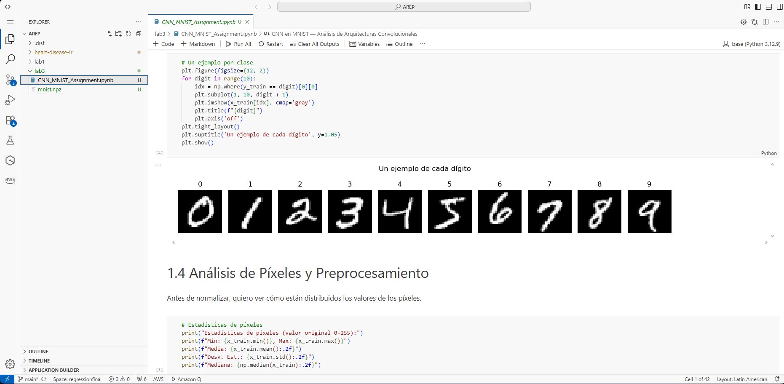
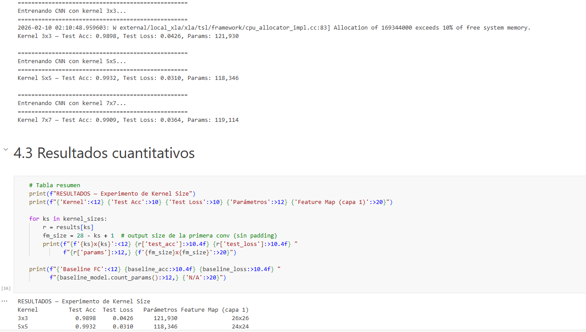

# CNN en MNIST — Análisis de Arquitecturas Convolucionales

**Autor:** Samuel Leonardo Albarracín Vergara
**Curso:** AREP
**Fecha:** Febrero 2026

---

## De qué trata esto

La idea del proyecto es entender qué hacen las capas convolucionales y por qué funcionan mejor que una red fully connected para clasificar imágenes. Para eso:

1. Hago un EDA del dataset
2. Entreno un modelo baseline sin convoluciones (Flatten + Dense)
3. Diseño una CNN justificando cada decisión arquitectónica
4. Hago un experimento controlado variando el tamaño del kernel
5. Respondo preguntas sobre el sesgo inductivo y cuándo conviene (o no) usar CNNs

Todo se ejecutó en **Amazon SageMaker**.

## Dataset

Uso **MNIST**, el dataset clásico de dígitos manuscritos (0 al 9):

- 60,000 imágenes de entrenamiento, 10,000 de prueba
- Imágenes de 28×28 píxeles, escala de grises
- 10 clases, distribución balanceada (~6000 muestras por dígito)
- Preprocesamiento: normalización de [0, 255] a [0, 1]

¿Por qué MNIST? Porque los dígitos tienen patrones espaciales claros (bordes, curvas, intersecciones) que son justo lo que un kernel convolucional debería detectar. Además es liviano y entrena rápido, lo cual me permite experimentar sin esperar horas.

## Arquitecturas

### Baseline (Fully Connected)

Input (28x28) → Flatten (784) → Dense(128, ReLU) → Dense(10, Softmax)

~101,770 parámetros. El Flatten aplana la imagen y se pierde toda la info espacial.

### CNN

Input(28x28x1) → Conv2D(32, 3x3) → MaxPool(2x2)
               → Conv2D(64, 3x3) → MaxPool(2x2)
               → Flatten → Dense(64, ReLU) → Dense(10, Softmax)

~121,930 parámetros. Usa kernels 3×3 para detectar patrones locales y MaxPooling para reducir dimensiones.

### ¿Por qué estas decisiones?

- **2 capas conv** porque MNIST es simple: la primera detecta bordes, la segunda los combina en formas
- **Kernel 3×3** es el más chico con sentido. En imágenes de 28×28 un kernel grande achica mucho el feature map
- **Filtros 32 → 64** van aumentando conforme se reduce el tamaño espacial
- **MaxPooling** y no Average porque me interesan las activaciones fuertes (donde está el trazo)
- **Dense(64)** más chica que el baseline (128) porque las conv ya extrajeron features compactas

## Resultados

### Baseline vs CNN

| Modelo | Test Accuracy | Test Loss | Parámetros |
|--------|:---:|:---:|:---:|
| Baseline (FC) | ~97% | ~0.09 | ~101,770 |
| CNN (kernel 3x3) | ~99% | ~0.03 | ~121,930 |

La CNN mejora ~2% en accuracy. Parece poco, pero significa que se equivoca en la mitad de casos.

### Experimento: Kernel Size

Probé 3 tamaños de kernel manteniendo todo lo demás igual:

| Kernel | Test Accuracy | Parámetros |
|:---:|:---:|:---:|
| 3×3 | ~99% | ~121k |
| 5×5 | ~99% | ~135k |
| 7×7 | ~98% | ~157k |

El 3×3 es el más eficiente. El 7×7 tiene más parámetros y achica demasiado los feature maps para imágenes de 28×28.

> Los valores exactos de accuracy varían un poco entre ejecuciones.

## Ejecución en SageMaker

### Cómo lo ejecuté

Como SageMaker no tiene acceso a internet (al menos en mi configuración), tuve que:

1. Descargar mnist.npz en mi computador local
2. Subir tanto el notebook como mnist.npz arrastrándolos a SageMaker, en la ruta user-default-efs/AREP/lab3/
3. Cargar el dataset con np.load('mnist.npz') en vez de keras.datasets.mnist.load_data(), para no depender de internet

## Estructura del repositorio

AREP3/
├── CNN_MNIST_Assignment.ipynb    # Notebook principal con todo el análisis
├── mnist.npz                      # Dataset (se sube manual a SageMaker)
├── img/                           # Capturas de pantalla
│   ├── sagemaker_notebook.png
│   └── sagemaker_results.png
└── README.md

## Cómo ejecutar

1. Abrir SageMaker Studio y navegar a la carpeta del proyecto
2. Subir mnist.npz a la misma carpeta del notebook si no está
3. Ejecutar todas las celdas en orden (Run All)

Si se quiere correr en local, se necesita Python 3.9-3.12 con TensorFlow instalado (Python 3.13+ no es compatible con TensorFlow todavía).
